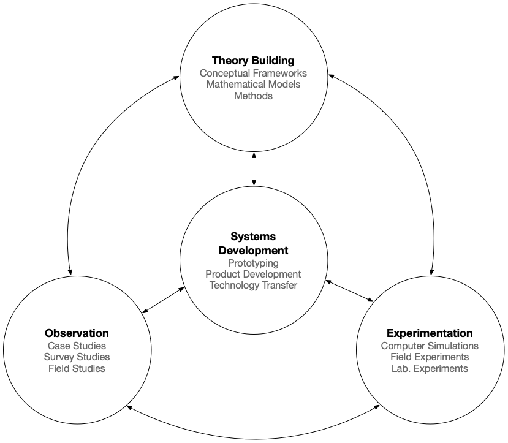
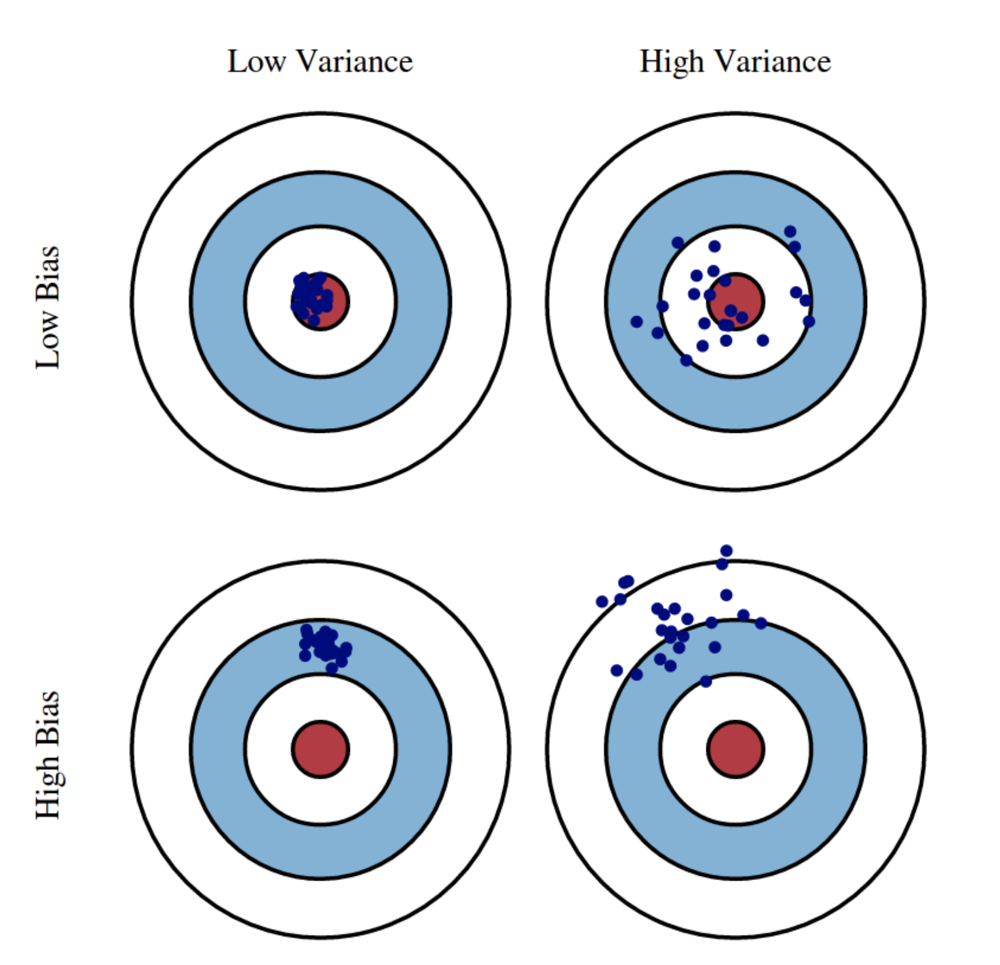

Lecture 7 Part 1
================

Finding and using references
----------------------------

As the world’s largest computing society, ACM brings together computing educators, researchers, and professionals. The ACM Library contains academic journals, conference proceedings and magazines from every computer related subject; computer science, big data, encryption, algorithms, security, HCI, database and network systems and much more.
`https://bibliotek.kea.dk/en/common/acm-library <https://bibliotek.kea.dk/en/common/acm-library>`_

Google Scholar is a great tool for finding articles. Some materials are directly available via links, but many materials are hidden behind paywalls.
`https://scholar.google.com <https://scholar.google.com>`_

A new and promising entry is Semantic Scholar, which is an AI powered search engine, with many features not found in Google Scholar.
`https://www.semanticscholar.org <https://www.semanticscholar.org>`_

Good and Bad Sources
--------------------

Not all sources are of the same quality. From best to worst:

* Respected science journals: peer-review process is in place to ensure best scientific standards.
* Books from respected publishers: editorial process in place, but not as rigorous as the peer-review process.
* Respected new sources: in some fields it is necessary to rely on such sources, but they should be used critically.
* Everything else: blog posts, YouTube videos, tabloid news etc.

You should restrict your sources to respected science journals whenever possible.
Remember that your work is only as solid as the foundation it is built upon.

Predatory journals are journals that appear to be peer-reviewed, but are not, and will publish anything if only you pay them money.
These journals must be avoided.

It can be difficult to say whether a journal is a predatory journal.
The following is a list of tools you can use to check if a source is recognized in science.

* `http://www.cabells.com <http://www2.cabells.com>`_
* `https://doaj.org <https://doaj.org>`_
* `https://thinkcheckattend.org <https://thinkcheckattend.org>`_
* `https://ufm.dk/forskning-og-innovation/statistik-og-analyser/den-bibliometriske-forskningsindikator/BFI-lister <https://ufm.dk/forskning-og-innovation/statistik-og-analyser/den-bibliometriske-forskningsindikator/BFI-lister>`_

Also remember: the fact that something is published in a scientific journal does not mean that it's true, but we can assume that it was the best of our knowledge at the time it was published, and that great care was put into ensuring that.

Managing references
-------------------

Many people prefer to use a reference manager for keeping track of sources.

There are several different products out there: RefWorks, Mendeley, and EndNote - just to name a few.

They pretty much offer the same functionality, so it is not important which one you choose.

The general standard for exchanging references is the BibTex format.

Latex
-----

Latex is widely used in academic writing.
It has several advantages over Word and other tools:

* It is plain text, so it plays well with version control systems
* It is extremely powerful
* It lets you focus on content rather than presentation
* It is code!

You can work interactively with Latex using `Overleaf <https://overleaf.com>`_.

Here are a few good sources for learning Latex:

* `LearnLatex.org <https://www.learnlatex.org/en/>`_
* `Overleaf Documentation <https://www.overleaf.com/learn>`_

.. note:: Latex Demo.

You can find a  demo Latex document with `Makefile` for generating the PDF file here:

* `AAI Latex Demo <https://gitlab.com/kea-teachers/aai-latex-demo>`_

Writing a good paper
--------------------

It is important that your paper i well referenced. Use internal cross references in your papers to link things together, as well as external sources.

Any claim you make must be supported by references or empirical evidence.

The structure of a paper always depend on content and context. However, in Data Science your paper should usually follow this structure:

| Abstract
| Introduction
|   Research Question/Problem Formulation
| Methods
| Analysis
| Findings
| Conclusion

Abstract
^^^^^^^^

The abstract must be very brief, but must communicate your problem, conclusion, and most essential findings.
The reader should be able to decide whether the paper is of interest to him by reading the abstract.
Very often, the abstract is the last part that you write, so given how important it is, make sure to set aside time for this.

Introduction
^^^^^^^^^^^^

The introduction must put your paper into a context.
The reader should be able to understand your paper based on the background information provided in the introduction.

Research Question/Problem Formulation
^^^^^^^^^^^^^^^^^^^^^^^^^^^^^^^^^^^^^^

The research question must be phrased as a question, ending with *"?"*.
It is often a good idea to structure your research question into one overall question with a number of sub-questions, and you can number them i.e. Q1, Q2 etc. to make it easy to refer to them.

Alternatively, you can phrase a hypothesis instead of a research question.

Methods
^^^^^^^

The methods section is for documenting the methods you apply to conduct your research.
It is about the methods and how they will be applied, but not about their actual application.
Ideally, you should write your method section before you start the actual research.
The methods section must be well referenced.

Analysis
^^^^^^^^

In the analysis section you apply the methods you described in the method section.
It is specific to your particular paper and your particular research question.
Make sure to make cross references back to your method section.

Findings
^^^^^^^^

Here you present your findings, that is what came out of your analysis.
Make sure to cross reference back to your analysis section.

Conclusion
^^^^^^^^^^

In the conclusion you answer your research question based on your findings.
Make sure to make cross references to your research question, analysis, and findings sections.

Methods
-------

It is very important that the methods we apply in our Data Science projects are *transparent* and *reproducible*.
To ensure this, we must be rigorous with our methods, and the methods section is therefore a key part of the paper.

    Nunamaker et al. multi-methodological research method.

Nunamaker Jr, Jay F., Minder Chen, and Titus DM Purdin. "Systems development in information systems research." Journal of management information systems 7.3 (1990): 89-106.

The Nunamaker paper describes a methodological approach that is very useful in Data Science.

Rather than a linear research method, this approach can be considered an *agile reasearh model*, in that we continuously go back and forth between *theory building*, *systems development*, *observation*, and *experimentation*.

.. note:: **Assignment 2**

    Read the paper by Nunamaker.

    Nunamaker Jr, Jay F., Minder Chen, and Titus DM Purdin. "Systems development in information systems research." Journal of management information systems 7.3 (1990): 89-106.

    In your groups, write a summary and review of the Nunamaker paper (1 to 2 pages).

    This is not a Data Science paper, so the structure discussed in Writing Papers is not a good structure.
    Make sure to use proper referencing.

    **Deadline:** Monday 13th September, 8:00.

    Use this repository for submissing - use PDF written in Latex.

What We Can And Can't Do With Machine Learning
----------------------------------------------

What is the difference between:

* Artificial Intelligence
* General Artificial Intelligence
* Machine Learning

.. figure:: _static/tasks.png
    :align: center
    :alt: xkcd tasks comic
    :figclass: align-center

    Machine Learning changed what we can do with computers.

Almost all practical applications of artificial intelligence has been found in machine learning, and especially in two areas of supervised machine learning: classification and regression.

.. note:: Read the paper Ng, Andrew. "What artificial intelligence can and can’t do right now." Harvard Business Review 9.11 (2016).

What is the point that Andrew Ng makes?

Does this align with your perceptions?

Supervised and Unsupervised Learning
------------------------------------

.. glossary::

    Supervised Learning
        In supervised learning we learn from labeled data.
        Supervised learning is a very powerful learning method, but it can be very costly to create labeled data sets.

    Unsupervised Learning
        In unsupervised learning we don't have labeled data, so we must learn about data points based on their relation to other data points.
        Unsupervised learning is open for a wider range of problems than supervised learning, but the insights we can gain are less powerfull.

Classification, Regression, and Clustering
------------------------------------------

.. glossary::

    Classification
        Classification problems are about labeling data, or assigning a category.
        As an example, we could have a classifier telling us if an image has a bird in it: *bird* and *non-bird* images.

    Regression
        Regression is about estimating continuous values, e.g. given a set of features about a house predict its price.

    Clustering
        Clustering is about a data point's relation (e.g. *distance*) to other data points, or the similarity between data points.

    Ranking
        Ordering of data points, finding best and worst sampels.

    Recommendations
        Based on rankings of samples, find sampels of interest.

    Anormaly Detection
        Find outliers, false data.

    Similarity Detection
        Ways of comparing samples and express their similarity by different metrics.

Bias-Variance Trade-Off
-----------------------

In machine learning we constantly have to balance *bias* and *variance*.

    Illustration of bias and variance.

What is bias and variance?

Bias
----

What are examples of a bias problem?
